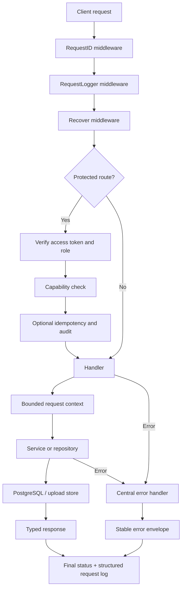

# Go Fiber backend API

## 1. Overview

The backend is a Go Fiber REST API backed by PostgreSQL through GORM. It
provides distinct health probes, an embedded OpenAPI/Swagger contract, item
reads, product CRUD with pagination and file uploads, and a complete
authentication lifecycle. Production concerns are implemented with PostgreSQL
and GORM: versioned migrations, atomic token rotation, audit events,
idempotency records, and durable background jobs.

The implementation follows a deliberately small layered design:

```text
HTTP request
    ↓
Global middleware (request ID → logging → panic recovery)
    ↓
Handler (HTTP parsing, validation, response mapping)
    ↓
Service (business and security workflow, where needed)
    ↓
Repository interface (persistence contract)
    ↓
GORM / PostgreSQL
```

### Deliberate scope choices

- GORM remains the only ORM and database access abstraction.
- PostgreSQL backs idempotency and durable jobs; Redis is not required.
- Fiber's standard JSON encoding remains in place; no replacement JSON codec
  or generated serializer is introduced.
- Fiber v2 remains the runtime for this platform upgrade. A v3 migration is a
  separate breaking-change project so route, middleware, and context behavior
  can be reviewed independently rather than mixed with security/schema changes.
- Swagger/OpenAPI support is included and shipped inside the API binary.
- k6 load baselines and pprof endpoints are intentionally outside this scope.
  Performance work should begin only when a representative workload and safe
  profiling environment are available.

### Library choices

| Library                                              | Role                                    | Why it fits this API                                                                                                                                        |
| ---------------------------------------------------- | --------------------------------------- | ----------------------------------------------------------------------------------------------------------------------------------------------------------- |
| GORM + PostgreSQL driver                             | All application persistence             | Already established, typed model mapping, transactions, clauses, and connection-pool control without operating two ORMs                                     |
| `go-playground/validator`                            | Reusable DTO tag validation             | Mature cached reflection metadata and structured field failures; domain-specific product rules remain explicit code                                         |
| `golang-migrate` with embedded `io/fs` source        | Ordered schema upgrades                 | Migration state lives in PostgreSQL and the SQL ships in the binary, removing a runtime file-copy dependency                                                |
| Fiber contrib Swagger                                | Swagger UI and embedded OpenAPI serving | Matches Fiber v2 middleware and accepts the in-memory contract directly                                                                                     |
| Fiber OpenTelemetry middleware + OTLP HTTP exporters | Traces and metrics                      | Standard propagation and vendor-neutral export; direct trace/metric exporters avoid the broader auto-export dependency graph                                |
| Testcontainers PostgreSQL module                     | Integration tests                       | Exercises real PostgreSQL locking, SQLSTATEs, migrations, JSONB, arrays, and `RETURNING` rather than relying on a behaviorally different in-memory database |

Each added runtime dependency owns a cross-cutting concern that would be costly
to implement safely. Testcontainers is test-only. The API does not add a cache,
message broker, alternate ORM, or serializer simply to increase the library
count.

The main packages are:

| Package                  | Responsibility                                                     |
| ------------------------ | ------------------------------------------------------------------ |
| `cmd/server`             | Application composition, route registration, startup, and shutdown |
| `internal/config`        | Typed environment configuration and startup validation             |
| `internal/middleware`    | Request IDs, structured logs, recovery, and error responses        |
| `internal/handler`       | Fiber-specific request and response handling                       |
| `internal/auth`          | Password, JWT, session, and password-reset business rules          |
| `internal/repository`    | Database access behind interfaces                                  |
| `internal/model`         | Persistence models and allowed list fields                         |
| `internal/pagination`    | Framework-independent collection query contract                    |
| `internal/upload`        | Bounded local file storage                                         |
| `internal/apperror`      | Typed errors crossing layers                                       |
| `internal/migrations`    | Embedded, ordered PostgreSQL migrations                            |
| `internal/idempotency`   | PostgreSQL-backed create-request replay protection                 |
| `internal/background`    | Durable job claiming, retry, and maintenance                       |
| `internal/openapi`       | Embedded OpenAPI contract and Swagger UI                           |
| `internal/observability` | OpenTelemetry provider lifecycle                                   |

### Responsibility rule

- Handlers own HTTP concerns: headers, cookies, status codes, body parsing, and
  response serialization.
- Services own workflows that span multiple persistence operations or enforce
  business/security rules.
- Repositories own query construction and persistence behavior.
- Models represent stored data; request DTOs represent client input.
- `main` owns wiring and process lifecycle, not business logic.

This separation keeps Fiber-specific code at the HTTP edge and GORM query
details in repositories. GORM is the project's only ORM; repository interfaces
exist for responsibility boundaries and testability, not to maintain a second
persistence implementation.

---

## 2. Runtime request flow



The middleware order matters. A request ID must exist before logging or panic
recovery runs. The request logger invokes the central error handler before it
records the status, so an error returned by a handler is logged as the actual
`4xx` or `5xx` sent to the caller rather than Fiber's untouched default `200`.

### Why this practice

- One request ID connects the client response, completion log, and server error
  log during investigation.
- One error boundary prevents every handler from inventing a response format.
- Panic recovery keeps one defective request from terminating the process while
  still logging the stack server-side.
- Logging after the response is resolved produces operationally trustworthy
  status and duration fields.

### Trade-off

The custom request logger handles returned errors itself and then returns
`nil`. Future middleware must preserve that behavior or Fiber may render the
same error twice. Its unit test should be kept when middleware ordering changes.

---

## 3. Endpoint catalogue

Base URL in local Docker development: `http://127.0.0.1:8081`.
The frontends use the same-origin `/api` proxy instead of calling this port
directly.

| Method   | Path                        | Access                  | Purpose                                           |
| -------- | --------------------------- | ----------------------- | ------------------------------------------------- |
| `GET`    | `/livez`                    | Public                  | Process liveness                                  |
| `GET`    | `/readyz`                   | Public                  | Database-backed readiness                         |
| `GET`    | `/startupz`                 | Public                  | Route-composition startup state                   |
| `GET`    | `/health`                   | Public                  | Legacy alias of readiness                         |
| `GET`    | `/api/docs`                 | Public                  | Interactive Swagger UI                            |
| `GET`    | `/api/openapi.yaml`         | Public                  | OpenAPI 3.1 contract                              |
| `GET`    | `/api/items`                | Public                  | List seeded items                                 |
| `GET`    | `/api/products/`            | Public                  | Filtered and paginated product list               |
| `GET`    | `/api/products/:id`         | Public                  | Product detail                                    |
| `POST`   | `/api/products/`            | `products:create`       | Idempotent create from JSON or multipart          |
| `PATCH`  | `/api/products/:id`         | `products:update`       | Version-aware partial update                      |
| `DELETE` | `/api/products/:id`         | `products:delete`       | Version-aware delete                              |
| `POST`   | `/api/auth/login`           | Public, throttled       | Authenticate and create a session                 |
| `POST`   | `/api/auth/refresh`         | Refresh cookie          | Rotate refresh token and issue a new access token |
| `POST`   | `/api/auth/logout`          | Refresh cookie optional | Revoke the current or all sessions                |
| `GET`    | `/api/auth/me`              | Authenticated           | Read the current identity from the database       |
| `POST`   | `/api/auth/forgot-password` | Public, throttled       | Request a single-use reset grant                  |
| `POST`   | `/api/auth/reset-password`  | Public, throttled       | Consume a reset grant and change the password     |

Product reads are public so catalogue and showcase pages can render without a
session. Writes require a valid access token and an explicit capability. The
current role-to-capability map grants all three product mutations to admins and
none to normal users. Capability checks avoid spreading role-name conditionals
through handlers and make future policy changes local.

---

## 4. Stable response contracts

### Error response

Every error routed through the central handler has one shape:

```json
{
  "error": {
    "code": "VALIDATION_FAILED",
    "message": "Please correct the highlighted fields.",
    "fields": { "productId": "must be 3–15 characters" },
    "requestId": "25ed9837-9de7-426c-bd44-440558ce57d1"
  }
}
```

`code` is for program logic, `message` is safe for display, and `requestId` is
for support and log correlation. Unexpected internal errors are logged with
their cause but returned as the generic `INTERNAL_ERROR`; database details and
stack traces do not cross the API boundary.

### Why this practice

Clients should branch on a stable code, not English text. A shared envelope also
lets the React and Angular frontends use the same normalizer. Hiding internal
causes avoids exposing SQL, filesystem paths, or implementation details while
preserving diagnostics in structured logs.

### Product collection response

```json
{
  "items": [],
  "total": 0,
  "page": 1,
  "pageSize": 25,
  "hasMore": false
}
```

When `withTotal=false`, `total` is `null`: this is distinct from a counted total
of zero. Keyset responses may also contain `nextCursor`.

### Login response

```json
{
  "token": "short-lived-access-token",
  "expiresIn": 900,
  "user": {
    "id": 1,
    "email": "admin@gmail.com",
    "displayName": "Ada Admin",
    "role": "admin"
  }
}
```

The refresh token is intentionally absent from JSON. It is sent only as the
`idol_refresh` httpOnly cookie.

---

## 5. Error handling as a cross-layer contract

Business-facing failures use `apperror.Error`, which carries an HTTP status,
machine-readable code, safe message, and wrapped cause. Repositories return
sentinel errors such as `ErrNotFound` and `ErrDuplicate`; handlers translate
those into endpoint-specific API errors.

```go
if errors.Is(err, repository.ErrNotFound) {
    return apperror.New(
        http.StatusNotFound,
        "NOT_FOUND",
        "No product with that id.",
        err,
    )
}
```

### Why this practice

- Repository code does not depend on HTTP status codes.
- Handlers can give the same persistence condition different public wording
  when endpoint context differs.
- `%w`, `errors.Is`, and `errors.As` preserve classification across layers.
- A single renderer guarantees the same JSON contract for Fiber, validation,
  authentication, repository, and unexpected errors.

PostgreSQL uniqueness failures are classified through the typed `pgconn.PgError`
SQLSTATE rather than matching driver message text. That keeps the HTTP conflict
contract stable across message-format or localization changes.

---

## 6. Configuration and fail-fast startup

Configuration is loaded once into typed structs. The process refuses to start
when required or unsafe values are detected.

| Variable                          | Default                       | Behavior                                     |
| --------------------------------- | ----------------------------- | -------------------------------------------- |
| `LISTEN_ADDRESS`                  | `:8080`                       | Fiber bind address                           |
| `REQUEST_TIMEOUT`                 | `5s`                          | Per-request database/service deadline        |
| `MAX_REQUEST_BODY_SIZE`           | `33554432`                    | Fiber request-body ceiling in bytes          |
| `DB_HOST`                         | `localhost`                   | PostgreSQL host                              |
| `DB_PORT`                         | `5432`                        | Must be a positive integer                   |
| `DB_NAME`                         | `items_app`                   | Database name                                |
| `DB_USER`                         | `items_user`                  | Database user                                |
| `DB_PASSWORD`                     | none                          | Required                                     |
| `DB_SSLMODE`                      | `disable`                     | PostgreSQL TLS mode                          |
| `DB_MAX_OPEN_CONNS`               | `10`                          | Pool ceiling                                 |
| `DB_MAX_IDLE_CONNS`               | `5`                           | Cannot exceed open connections               |
| `DB_CONN_MAX_LIFETIME`            | `30m`                         | Connection recycling                         |
| `APP_ENV`                         | `development`                 | Strict enum: development, test, production   |
| `AUTH_JWT_SECRET`                 | dev-only value                | Required in production and at least 32 bytes |
| `AUTH_ISSUER`                     | `idol-promo`                  | JWT issuer                                   |
| `AUTH_ACCESS_TTL`                 | `15m`                         | Access-token lifetime                        |
| `AUTH_SESSION_TTL`                | `24h`                         | Server ceiling for normal sessions           |
| `AUTH_REMEMBER_TTL`               | `720h`                        | Remember-me lifetime                         |
| `AUTH_SECURE_COOKIES`             | environment-based             | Defaults true outside development            |
| `AUTH_RESET_URL`                  | local reset page              | Must be absolute HTTPS in production         |
| `UPLOAD_ROOT`                     | `/var/lib/idol-promo/uploads` | Private storage directory                    |
| `UPLOAD_PUBLIC_URL`               | `/api/uploads`                | Public URL prefix stored with products       |
| `BACKGROUND_JOBS_ENABLED`         | `true`                        | Starts the PostgreSQL/GORM worker            |
| `BACKGROUND_JOB_POLL_INTERVAL`    | `1s`                          | Runnable-job polling interval                |
| `BACKGROUND_JOB_TIMEOUT`          | `30s`                         | Per-attempt execution deadline               |
| `BACKGROUND_MAINTENANCE_INTERVAL` | `1h`                          | Expired-record cleanup schedule              |
| `OTEL_ENABLED`                    | `false`                       | Enables trace and metric providers           |
| `OTEL_SERVICE_NAME`               | `idol-promo-api`              | OpenTelemetry resource service name          |

### Why this practice

Starting with an invalid configuration is worse than refusing to start: it
creates delayed failures under traffic. A stable JWT secret is mandatory in
production because a randomly regenerated secret would invalidate all sessions
after restart and would make multiple replicas disagree. Pool validation avoids
an internally contradictory database configuration.

Durations, booleans, positive integers, pool relationships, environment name,
production signing key, secure-cookie flag, HTTPS reset URL, and request limits
are parsed strictly. A malformed or unsafe value fails startup instead of
silently selecting a default.

---

## 7. Dependency composition and testability

Dependencies are constructed explicitly in `main` and passed through
constructors:

```go
productRepository := repository.NewProductRepository(db)
productHandler := handler.NewProductHandler(
    productRepository,
    uploadStore,
    cfg.RequestTimeout,
)
```

Handlers depend on small repository interfaces rather than concrete GORM
implementations. Authentication uses a service because a login, refresh, or
password reset coordinates several security decisions and database writes.

### Why this practice

- Dependencies are visible at startup rather than hidden in globals.
- Unit tests can supply a stub repository and execute a real Fiber request
  without PostgreSQL.
- Constructors prevent partially initialized handlers.
- The service layer appears where workflow complexity justifies it; a trivial
  item list does not receive an empty pass-through service merely for symmetry.

This is composition without a dependency-injection framework. For a service of
this size, explicit constructors have lower cognitive and runtime cost than a
container while preserving testability.

---

## 8. Bounded work and cancellation

Handlers derive a timeout context from Fiber's user context and pass it through
services into repositories:

```go
ctx, cancel := context.WithTimeout(c.UserContext(), h.timeout)
defer cancel()

page, err := h.repo.List(ctx, params)
```

All GORM operations use `WithContext(ctx)`, and health checks use
`PingContext`. Startup database ping and graceful server shutdown also have
deadlines.

### Why this practice

A disconnected client or slow database query must not occupy a connection and
goroutine indefinitely. One propagated context gives the whole request a common
cancellation signal and deadline. This protects both latency and the finite
database connection pool.

### Trade-off

A single `REQUEST_TIMEOUT` is simple but may be too coarse once endpoints have
very different workloads. Export or batch endpoints should receive an explicit
policy instead of silently increasing the global timeout.

---

## 9. Database connection management

Startup retries database opening up to ten times, then performs a five-second
bounded ping. This accommodates container startup ordering while still failing
deterministically. The SQL pool configures maximum open and idle connections,
connection lifetime, and idle lifetime; all connections use UTC.

### Why this practice

- Compose health dependencies reduce races but do not eliminate transient
  network or initialization failures.
- A bounded retry absorbs normal startup timing without masking a persistent
  outage forever.
- Pool limits prevent the API from overwhelming a small PostgreSQL instance.
- Recycling connections avoids keeping stale network/database sessions forever.
- UTC storage prevents server-local timezone changes from altering comparisons.

### Trade-off

The retry uses increasing fixed sleeps and holds startup. This is suitable for
the current single service, but a larger deployment may prefer jittered
exponential backoff and readiness kept false until dependencies recover.

---

## 10. Authentication and session security

### Session design

| Credential                | Client location               | Default lifetime                          | Purpose                    |
| ------------------------- | ----------------------------- | ----------------------------------------- | -------------------------- |
| Access token              | Frontend memory               | 15 minutes                                | Bearer authorization       |
| Refresh token             | httpOnly, SameSite=Lax cookie | Browser session / server maximum 24 hours | Normal session renewal     |
| Remember-me refresh token | Same cookie with expiry       | 30 days                                   | Persistent session renewal |
| Password-reset token      | Reset link, single use        | 1 hour                                    | Password recovery          |

Access tokens are HS256 JWTs with a pinned signing algorithm, issuer, issued-at,
not-before, and expiry claims. Refresh and reset tokens are cryptographically
random opaque values. Only their SHA-256 hashes are stored in PostgreSQL.

### Why short access tokens and opaque refresh tokens

The JWT contains a snapshot of identity and role. It is cheap to verify but is
not looked up in the database on every protected request, so a short lifetime
bounds how long a role change or revocation can remain stale. The longer-lived
credential is opaque, stored in an httpOnly cookie, and checked server-side,
where it can be revoked.

SHA-256 is appropriate for generated 256-bit random tokens because they already
have high entropy. Passwords are different: people choose low-entropy values,
so they use salted, deliberately expensive bcrypt at cost 12.

### Refresh rotation and replay response

Every successful refresh revokes the presented token and creates a new one. If
an already revoked token is presented, the service treats it as possible replay
and revokes every refresh token for that user.

### Why this practice

A stolen refresh token can otherwise be replayed for its entire lifetime.
Rotation limits each token to one use, and family-wide revocation responds to a
strong sign of session theft. The original session lifetime is preserved, so a
normal session cannot silently become a 30-day remembered session during
refresh.

### Password handling

- Passwords are never stored or serialized.
- bcrypt hashes are salted and can be upgraded opportunistically after a valid
  login.
- Passwords must be at least 12 characters and no more than 72 bytes.
- The 72-byte limit prevents bcrypt's silent truncation from making two long
  inputs equivalent.
- A single repeated character is rejected, while arbitrary composition rules
  are avoided so passphrases remain usable.

### Enumeration and brute-force controls

- Missing user and wrong password return the same public error.
- Missing-user login performs dummy bcrypt work to reduce timing differences.
- Forgot-password returns `202` with the same message whether an account exists.
- Credential endpoints allow 10 requests per IP per minute.
- Five failed attempts lock the account for 15 minutes, with state stored in
  PostgreSQL so restart does not erase it.

IP throttling and account lockout solve different problems: the former limits
one source spraying many accounts; the latter limits many sources attacking one
account.

### Authorization

`RequireAuth` verifies Bearer tokens and stores typed claims in Fiber locals.
`RequirePermission` resolves the token role through a central capability map;
product handlers do not contain policy branches. `/api/auth/me` reads the user
from the database rather than echoing token claims so current account state is
returned.

Refresh rotation and password reset execute inside GORM transactions. The
presented token row is selected with `FOR UPDATE`, which serializes concurrent
consumers before one token is revoked and its replacement is written. This
prevents partial commits and concurrent double use.

Requesting a new password-reset grant locks the user row, invalidates older
unused grants, and creates the replacement in one transaction. Login-failure
counting and lockout activation happen in one SQL update so concurrent wrong
password attempts cannot bypass the threshold with lost updates.

### Cookie safety

The refresh cookie is `HttpOnly`, `SameSite=Lax`, scoped to `/api/auth`, and
`Secure` outside development. Scoping narrows where the browser sends the
credential, JavaScript cannot read it, and cross-site POST requests do not
receive it under Lax policy.

### Current limitations

- The Fiber rate limiter uses process-local storage. Multiple API replicas need
  an infrastructure-level rate limit for a global IP budget. Redis is
  deliberately not part of this implementation.
- Production reset-email delivery is not implemented; only development returns
  the reset link. A production mail provider and audited delivery workflow are
  required.
- Role checks use the access-token snapshot until expiry. High-risk immediate
  revocation would require a server-side token version or denylist check.

---

## 11. Validation and PATCH semantics

Product writes use a request DTO rather than binding directly into the GORM
model. Every DTO field is a pointer, which distinguishes:

- missing field: leave it unchanged during `PATCH`;
- present zero, false, empty, or null-like value: intentionally update it.

JSON and multipart bodies decode into the same `productInput` and run through
the same conversion and validation routine.

### Why this practice

Binding a partial update into a value struct loses the difference between “not
sent” and “sent as zero.” Using one input pipeline also prevents JSON and upload
requests from gradually accepting different business rules.

Validation exists in two layers:

1. Handler DTO validation returns readable `422` messages tied to API field
   names.
2. PostgreSQL `CHECK`, `NOT NULL`, `UNIQUE`, and foreign-key constraints protect
   the data even when another writer bypasses this API.

This is deliberate defense in depth, not accidental duplication. Application
validation improves user feedback; database constraints provide the final
integrity guarantee under concurrency and alternate writers.

### Domain-specific types

- Prices use `decimal.Decimal` and PostgreSQL `NUMERIC(12,2)`, never binary
  floating point.
- Multi-select values use `TEXT[]`, allowing array containment queries and GIN
  indexes.
- Dates use a date column and require `YYYY-MM-DD` at the API boundary.
- Enum-like values are allowed by both handler maps and database checks.

### Limitation

Malformed multipart integer fields are currently treated as absent because the
form decoder only assigns successfully parsed values. They should instead
produce a `422` validation error so JSON and multipart behavior are identical.

---

## 12. Pagination, filtering, and query safety

The reusable pagination package supports three modes:

| Mode   | Query                     | Use case                       | Cost                                              |
| ------ | ------------------------- | ------------------------------ | ------------------------------------------------- |
| Offset | `?page=2&pageSize=25`     | Numbered data grid             | Deep pages scan skipped rows                      |
| Keyset | `?mode=keyset&cursor=...` | Infinite scroll                | Fast at depth; forward-only and default sort only |
| All    | `?mode=all`               | Export or small reference list | Intentionally unbounded result set                |

Common query parameters:

| Parameter                               | Behavior                                     |
| --------------------------------------- | -------------------------------------------- |
| `pageSize`                              | Defaults to 25 and is capped at 200          |
| `withTotal=false`                       | Skips the count query                        |
| `search`                                | Searches product name and product ID         |
| `sortBy`                                | Allowed API sort name only                   |
| `sortDir=desc`                          | Descending order; other values are ascending |
| `category`, `condition`, `availability` | Exact filters                                |
| `isPublished`                           | Boolean filter                               |
| `tag`, `region`                         | PostgreSQL array containment filters         |

### Why this practice

- The 200-row ceiling stops a public query from requesting arbitrary database
  work.
- `withTotal=false` avoids a count that infinite scroll does not use.
- Fetching `pageSize + 1` determines `hasMore` without another query.
- Keyset pagination uses `(created_at, id)` and the matching composite index,
  keeping deep-page work stable.
- Every order ends with a unique ID, preventing equal sort values from causing
  duplicates or omissions between pages.
- Sort columns are selected from a server-owned map. SQL parameters cannot bind
  identifiers, so directly interpolating `sortBy` would be an injection risk.
- Filters are also allowlisted and their values remain parameterized.

### Framework-independent adapter

The pagination parser requires only this interface:

```go
type Query interface {
    Get(key string) string
}
```

The Fiber handler supplies a tiny adapter. This keeps reusable parsing logic
testable without starting Fiber and reusable with another HTTP framework.

### Limitations

- `mode=all` has no result ceiling and is public. Large datasets should use a
  streamed, authorized export job or a configured export limit.
- Cursors are opaque Base64 values, not signed secrets. Clients should treat
  them as tokens, but the server validates their shape rather than trusting
  them.
- Invalid page numbers are clamped to safe defaults instead of returning `400`.
  This is friendly to data grids but should be documented in public API
  contracts.

---

## 13. File upload handling

Product create and update accept either JSON or `multipart/form-data`. The local
upload store applies the following safeguards:

- 10 MiB maximum per file;
- allowlisted extensions;
- MIME sniffing of file bytes and extension/content-type agreement;
- random server-generated filename;
- caller subdirectory reduced to its base name;
- exclusive file creation to avoid overwrite races;
- a limit reader that verifies actual bytes even if the multipart header lies;
- removal of partially written files after copy failure;
- cleanup of staged files after database failure;
- cleanup of replaced and deleted product files;
- restrictive directory and file permissions;
- upload data in a named volume while the container filesystem remains
  read-only.

### Why this practice

Client filenames are untrusted path input. Keeping only an approved extension
and generating the rest prevents traversal, collisions, and intentional
overwrites. Enforcing both declared and observed size protects disk capacity.
Keeping storage root separate from its public URL lets storage move later
without changing the value stored in product rows.

Uploads are served with directory browsing disabled and byte-range support,
which is useful for documents and media. The route is public because ordinary
`img` elements cannot attach a Bearer header.

`upload.Storage` is the handler-facing provider boundary. The shipped provider
uses the persistent local volume; an S3-compatible implementation can be added
without changing product orchestration. This project does not invent cloud
credentials, bucket policy, or public URL behavior until an object-storage
provider is selected.

### Current limitations

- Files are content-sniffed but not malware-scanned.
- The configured local volume is not a CDN and does not horizontally replicate.
- Public upload URLs are not suitable for private documents; those require
  authenticated downloads or short-lived signed URLs.

---

## 14. PostgreSQL schema practices

The initialization SQL chooses types and indexes around application behavior:

- `CITEXT` provides case-insensitive unique email lookup without wrapping every
  query in `LOWER()`.
- Refresh and reset tokens have unique hash constraints and user indexes.
- Foreign keys delete a user's sessions and reset grants with that user.
- Partial indexes exclude revoked refresh tokens and unpublished product rows
  where appropriate.
- Product list ordering has a matching `(created_at DESC, id DESC)` index.
- GIN indexes support tag and shipping-region array containment.
- Trigram search supports partial product-name matching.
- Database triggers maintain `updated_at` even when a writer forgets it.

### Why this practice

Correctness rules belong at the last shared write boundary. Indexes are chosen
from actual lookup, filter, and ordering patterns rather than added to every
column. This improves the hot paths without paying unnecessary write and disk
cost for unused indexes.

The API embeds ordered SQL migrations and applies them before constructing
repositories or marking startup complete. `golang-migrate` records the schema
version in PostgreSQL, so existing volumes receive only unapplied changes and a
failed migration prevents the process from serving traffic. The historical
`db/init/` scripts remain useful for initial seed data; schema evolution belongs
in `api/internal/migrations/sql/`.

### Optimistic concurrency

Every product has a positive `version`. Product reads and successful writes
return it in both JSON and an `ETag`; PATCH and DELETE accept `If-Match`.
Repositories include the expected version in the mutation predicate and
increment it in the same SQL statement. A stale writer receives `412
VERSION_CONFLICT` instead of silently overwriting a newer change.

`If-Match` remains optional for backward compatibility. Clients that edit data
should send it; a future API version can make it mandatory once all callers have
migrated.

### Idempotent creates

Authenticated product creation accepts `Idempotency-Key`. PostgreSQL stores the
key per actor scope, the request-body SHA-256, processing state, and the final
successful response, content type, and ETag. Repeating the same request replays
that contract; reusing a key with a different body or while the first request
is still processing returns `409`. Multipart fingerprints are canonicalized
from sorted fields plus file extension, size, and bytes, so a client may retry
with a newly generated multipart boundary or original filename.

This protects clients from duplicate inserts after a timeout without adding
Redis. Records expire after 24 hours and are removed by scheduled maintenance.

### Audit events

Successful product mutations append an audit event containing the actor,
action, resource identifier, request ID, IP address, and small metadata. Audit
failure is logged but does not report a completed business mutation as failed;
an audit-write outage should be monitored and alerted separately.

### PostgreSQL-backed background work

The background worker is intentionally built with GORM and the same PostgreSQL
database. A worker claims one pending row using `FOR UPDATE SKIP LOCKED`, records
a lease, executes with a deadline, retries with bounded exponential backoff, and
marks the job completed or failed. Stale leases are recovered after crashes.
A partial unique index prevents multiple replicas from scheduling the same
maintenance job concurrently.

The current recurring job deletes expired refresh/reset grants, idempotency
records, and old job history. The design is suitable for modest durable work and
transactional outbox-style additions. A dedicated broker is justified only when
queue volume, isolation, or delivery latency outgrows PostgreSQL.

### OpenAPI and Swagger

The OpenAPI 3.1 YAML is embedded in the binary, so documentation and executable
routes ship as one artifact. Swagger UI is available at `/api/docs`; the raw
contract is available at `/api/openapi.yaml`. It documents authentication,
schemas, validation errors, idempotency, and ETag preconditions.

The contract is maintained explicitly rather than generated from handler
comments. This keeps transport DTOs and examples readable, but route changes
must update the YAML in the same review.

---

## 15. Health, observability, and process lifecycle

`GET /livez` is process-only, `/readyz` checks PostgreSQL with a bounded context,
and `/startupz` stays unavailable until dependencies, migrations, routes, and
workers have been composed. `/health` remains a compatibility alias of
readiness.

Logs are JSON and carry method, path, final status, duration, and request ID.
Server failures include the internal cause only in the log. The service listens
in a goroutine, responds to `SIGINT` and `SIGTERM`, and gives in-flight requests
up to ten seconds to finish. Optional OpenTelemetry instrumentation exports
traces and metrics through standard OTEL environment variables and shuts its
providers down with a bounded context.

GORM uses a small `slog` adapter rather than its colored console logger. Normal
`record not found` control flow is not logged, slow queries and real database
errors are structured, and SQL text is omitted so bound credentials or personal
data cannot leak into logs.

### Why this practice

- A process-only health check can report healthy while every request fails due
  to a dead database.
- Structured fields are searchable and aggregatable without parsing prose.
- Graceful shutdown avoids terminating active requests during container
  replacement.
- A shutdown deadline prevents a stuck request from blocking deployment
  forever.

Telemetry is disabled by default because emitting signals without a configured
collector creates operational noise. Enabling it is a deployment decision; the
application stays vendor-neutral.

---

## 16. Container and deployment practices

The API Dockerfile runs tests in the build stage, produces a stripped static Go
binary, and copies it into a small Alpine runtime. The runtime installs only CA
certificates and timezone data and runs as an unprivileged `app` user.

Compose adds further controls:

- read-only root filesystem;
- writable named volume only for uploads;
- temporary `/tmp` filesystem;
- `no-new-privileges`;
- private database network and no production host port for the API;
- health-based dependency ordering;
- log size and file-count limits;
- an init process and a shutdown grace period.

### Why this practice

Multi-stage builds keep compilers and source code out of the runtime image.
Running without root and with a read-only filesystem reduces the impact of a
remote-code execution flaw. Network isolation makes PostgreSQL unreachable from
the public edge. Log rotation prevents container logs from silently filling the
disk.

### Trade-off

Alpine is compact and works for the current static binary. If a future
dependency requires CGO or system libraries, the build/runtime choice must be
reviewed rather than forcing it into the existing image.

---

## 17. Testing and quality gates

Current focused unit tests cover:

- password hashing, salting, length rules, and email normalization;
- opaque token uniqueness and stable hashing;
- JWT round-trip, expiry, issuer, key, and `alg:none` rejection;
- pagination defaults, limits, query allowlists, keyset selection, and count
  opt-out;
- Fiber handler success and centralized failure behavior with a stub repository;
- request logging of the final response status and request ID.
- strict environment parsing and body limits;
- field-name-aware request validation;
- ETag/`If-Match` parsing;
- file MIME detection, bounded copy, safe deletion, and traversal rejection;
- embedded Swagger contract availability.

Docker-tagged Testcontainers integration tests apply the real embedded
migrations to PostgreSQL 17 and cover stale product writes, unique background
job claiming, idempotent response replay, reset-token supersession, concurrent
refresh rotation, and atomic lockout counting. They are separate from the fast
suite because starting a database container on every edit would slow the normal
feedback loop.

The linter configuration is correctness-weighted. It includes resource leak,
SQL row/connection, context propagation, error wrapping, security, static
analysis, and formatting checks. Test files are linted too. CI runs tests, vet,
lint, formatting, and both frontend validation pipelines before deployment.

```bash
# Fast backend feedback
cd api
go test ./...
go vet ./...

# Real PostgreSQL integration suite (requires Docker)
go test -tags=integration ./internal/integration

# Pinned lint and formatting checks from repository root
make lint-api

# Full repository gate
make check
```

### Why this practice

Tests focus on boundaries where a small change can cause a security or
operational regression. A pinned linter version makes local and CI results
repeatable. Running tests during the image build prevents producing an image
from a source tree that fails the backend suite.

### Recommended test expansion

- authentication transaction rollback fault injection and password-reset races;
- product JSON/multipart contract tests;
- graceful shutdown and health failure tests;
- race detector in a scheduled or pre-release job: `go test -race ./...`.

---

## 18. Calling the API

The examples below assume direct local access at `http://127.0.0.1:8081`.
Keep the cookie jar for refresh/logout and copy the returned access token into
`API_ACCESS_TOKEN`.

### Health and items

```bash
curl -i http://127.0.0.1:8081/livez
curl -i http://127.0.0.1:8081/readyz
curl -s http://127.0.0.1:8081/api/items
```

Open interactive Swagger documentation at
`http://127.0.0.1:8081/api/docs`.

### Sign in

```bash
curl -i \
  -c /tmp/idol-cookie.jar \
  -H 'Content-Type: application/json' \
  -d '{
    "email": "admin@gmail.com",
    "password": "Password123!",
    "rememberMe": false
  }' \
  http://127.0.0.1:8081/api/auth/login
```

The seeded credentials are development-only and must be removed from any
exposed environment.

### Refresh and current user

```bash
curl -i \
  -b /tmp/idol-cookie.jar \
  -c /tmp/idol-cookie.jar \
  -X POST \
  http://127.0.0.1:8081/api/auth/refresh

API_ACCESS_TOKEN='paste-access-token-here'
curl -s \
  -H "Authorization: Bearer $API_ACCESS_TOKEN" \
  http://127.0.0.1:8081/api/auth/me
```

### List products with filters

```bash
curl -G -s http://127.0.0.1:8081/api/products/ \
  --data-urlencode 'page=1' \
  --data-urlencode 'pageSize=25' \
  --data-urlencode 'search=Aurora' \
  --data-urlencode 'category=electronics' \
  --data-urlencode 'sortBy=createdAt' \
  --data-urlencode 'sortDir=desc'
```

### Keyset page without a count

```bash
curl -G -s http://127.0.0.1:8081/api/products/ \
  --data-urlencode 'mode=keyset' \
  --data-urlencode 'pageSize=25' \
  --data-urlencode 'withTotal=false' \
  --data-urlencode 'cursor=paste-nextCursor-here'
```

Omit `cursor` for the first keyset page.

### Create with JSON

```bash
curl -i \
  -H "Authorization: Bearer $API_ACCESS_TOKEN" \
  -H 'Idempotency-Key: product-SKU-2001-attempt-1' \
  -H 'Content-Type: application/json' \
  -d '{
    "productId": "SKU-2001",
    "productName": "Orbit Headphones",
    "description": "Wireless over-ear headphones.",
    "price": "149.99",
    "rating": 4,
    "releaseDate": "2026-08-05",
    "condition": "new",
    "availability": "inStock",
    "tags": ["audio", "wireless"],
    "shippingRegions": ["na", "eu"],
    "warrantyMonths": 24,
    "isPublished": true,
    "acceptTerms": true,
    "category": "electronics"
  }' \
  http://127.0.0.1:8081/api/products/
```

Price is a JSON string so decimal precision is preserved across clients.

### Create with files

```bash
curl -i \
  -H "Authorization: Bearer $API_ACCESS_TOKEN" \
  -F 'productId=SKU-2002' \
  -F 'productName=Field Guide' \
  -F 'description=Illustrated field guide.' \
  -F 'price=24.95' \
  -F 'releaseDate=2026-08-05' \
  -F 'condition=new' \
  -F 'availability=inStock' \
  -F 'shippingRegions=na' \
  -F 'shippingRegions=eu' \
  -F 'acceptTerms=true' \
  -F 'category=books' \
  -F 'productImage=@/absolute/path/cover.png' \
  -F 'productDocuments=@/absolute/path/guide.pdf' \
  http://127.0.0.1:8081/api/products/
```

### Version-aware partial update and admin delete

Read the product first and copy its `ETag` response header. The example assumes
the current value is `"3"`.

```bash
curl -i \
  -X PATCH \
  -H "Authorization: Bearer $API_ACCESS_TOKEN" \
  -H 'If-Match: "3"' \
  -H 'Content-Type: application/json' \
  -d '{"price":"139.99","isPublished":false}' \
  http://127.0.0.1:8081/api/products/1

curl -i \
  -X DELETE \
  -H "Authorization: Bearer $API_ACCESS_TOKEN" \
  -H 'If-Match: "4"' \
  http://127.0.0.1:8081/api/products/1
```

### Sign out

```bash
# Current device
curl -i -b /tmp/idol-cookie.jar -X POST \
  http://127.0.0.1:8081/api/auth/logout

# All devices represented by this user's refresh-token rows
curl -i -b /tmp/idol-cookie.jar -X POST \
  'http://127.0.0.1:8081/api/auth/logout?all=true'
```

---

## 19. Adding a new backend feature

Use this sequence for a new resource such as orders.

1. **Define the external contract first.** Decide request fields, response
   shape, status codes, error codes, auth policy, pagination, and idempotency.
2. **Add a versioned schema change.** Choose exact PostgreSQL types,
   constraints, foreign keys, and only indexes supported by known queries.
3. **Create the model.** Keep persistence tags and JSON behavior explicit; hide
   secrets with `json:"-"` even if a response DTO is also used.
4. **Create request/response DTOs.** Do not bind untrusted input directly into a
   persistence model, especially for partial updates or privileged fields.
5. **Define a small repository interface.** Include only operations the feature
   needs and accept `context.Context` first.
6. **Implement persistence.** Use `WithContext`, parameterized values,
   allowlisted identifiers, wrapped errors, and deterministic ordering.
7. **Add a service only when needed.** Put multi-step workflow, authorization
   decisions, transactions, or business rules there; do not create pass-through
   layers.
8. **Implement a thin handler.** Parse, validate, create the bounded context,
   invoke the service/repository, translate known errors, and serialize.
9. **Register routes and middleware in `main`.** Make public, authenticated,
   capability, idempotency, and audit policy visible at the composition root.
10. **Test boundaries.** Cover validation, auth, sentinel translation,
    cancellation, repository behavior, success contracts, and failure shapes.
11. **Update this document.** Add routes, examples, configuration, operational
    implications, and honest limitations.
12. **Run the quality gate.** At minimum run `go test ./...`, `go vet ./...`, and
    `make lint-api`.

### Suggested handler shape

```go
type OrderRepository interface {
    GetByID(context.Context, uint64) (*model.Order, error)
}

type OrderHandler struct {
    repo    OrderRepository
    timeout time.Duration
}

func (h *OrderHandler) Get(c *fiber.Ctx) error {
    id, err := parseID(c)
    if err != nil {
        return err
    }

    ctx, cancel := context.WithTimeout(c.UserContext(), h.timeout)
    defer cancel()

    order, err := h.repo.GetByID(ctx, id)
    if errors.Is(err, repository.ErrNotFound) {
        return apperror.New(http.StatusNotFound, "NOT_FOUND", "Order not found.", err)
    }
    if err != nil {
        return err
    }
    return c.JSON(order)
}
```

The example preserves the project conventions: explicit dependency, narrow
interface, bounded context, sentinel translation, centralized error rendering,
and no database details in the HTTP layer.

---

## 20. Best-practice decision summary

| Practice                                        | Why it is appropriate here                              | Cost accepted                                      |
| ----------------------------------------------- | ------------------------------------------------------- | -------------------------------------------------- |
| Explicit constructor wiring                     | Small service, visible dependencies, easy stubs         | More startup code                                  |
| Handler/service/repository boundaries           | Keeps Fiber, workflows, and GORM concerns separate      | More types and files                               |
| Typed centralized errors                        | Stable two-frontend contract and safe failures          | Errors must be translated deliberately             |
| Request IDs and JSON logs                       | Correlates distributed client/server failures           | Extra log volume                                   |
| Request deadlines                               | Protects goroutines and DB pool                         | Long work needs a separate policy                  |
| Fail-fast config                                | Prevents unsafe or half-working startup                 | Misconfiguration stops deployment immediately      |
| Short JWT + rotating opaque refresh             | Fast auth with revocable long sessions                  | More session state and refresh logic               |
| bcrypt for passwords, SHA-256 for random tokens | Matches hashing cost to threat model                    | bcrypt consumes CPU by design                      |
| IP throttle + persisted account lockout         | Covers spray and targeted guessing                      | Shared limiter needed for replicas                 |
| GORM transactions + row locks                   | Makes token consumption atomic under concurrency        | Lock scope must stay short                         |
| Capability-based authorization                  | Keeps policy out of handlers and role names centralized | New roles require an explicit mapping              |
| DTO plus DB validation                          | Good client messages and final data integrity           | Rules must stay synchronized                       |
| Pointer fields for PATCH                        | Preserves absent versus explicit zero                   | DTO is more verbose                                |
| Decimal money type                              | Exact business values                                   | JSON/client conversion needs care                  |
| Offset plus keyset pagination                   | Supports grids and scalable infinite scroll             | Two modes to document and test                     |
| Allowlisted sort/filter fields                  | Prevents identifier injection and accidental exposure   | New fields require explicit registration           |
| Bounded random-name upload store                | Prevents traversal, collisions, and disk exhaustion     | Needs more controls for sensitive production files |
| Database constraints and targeted indexes       | Protects all writers and accelerates real access paths  | Additional write/storage cost                      |
| Embedded versioned migrations                   | Upgrades existing PostgreSQL volumes deterministically  | Failed DDL blocks startup                          |
| ETag optimistic concurrency                     | Prevents silent lost updates                            | Clients must retain and send the version           |
| PostgreSQL idempotency records                  | Safe create retries without Redis                       | Replay records consume DB space until cleanup      |
| PostgreSQL/GORM background jobs                 | Durable work without another data service               | Not intended for very high queue throughput        |
| Embedded OpenAPI + Swagger UI                   | Contract ships with the same binary                     | YAML must be reviewed with route changes           |
| Optional OpenTelemetry                          | Vendor-neutral traces and metrics                       | Needs a collector and sampling policy              |
| Non-root read-only container                    | Reduces runtime attack surface                          | Writable paths must be designed explicitly         |
| Graceful shutdown                               | Safe container replacement                              | Deployment waits up to the deadline                |

The common principle is to put each guarantee at the narrowest shared boundary:
HTTP consistency in middleware, business rules in services, query safety in
repositories, integrity in PostgreSQL, and runtime containment in the image and
Compose configuration.

---

## 21. Source map

Formal evidence citations are not part of this document, but these locations
are the quickest entry points when maintaining the feature:

| Concern               | Location                                                                                  |
| --------------------- | ----------------------------------------------------------------------------------------- |
| Startup and routes    | `api/cmd/server/main.go`                                                                  |
| Configuration         | `api/internal/config/config.go`                                                           |
| Database pool         | `api/internal/database/database.go`                                                       |
| Error contract        | `api/internal/apperror/`, `api/internal/middleware/error_handler.go`                      |
| Request lifecycle     | `api/internal/middleware/request.go`                                                      |
| Authentication        | `api/internal/auth/`, `api/internal/handler/auth_handler.go`                              |
| Route authorization   | `api/internal/handler/auth_middleware.go`                                                 |
| Products              | `api/internal/handler/product_*.go`, `api/internal/repository/product_repository.go`      |
| Pagination            | `api/internal/pagination/`                                                                |
| Uploads               | `api/internal/upload/`                                                                    |
| Models                | `api/internal/model/`                                                                     |
| Versioned schema      | `api/internal/migrations/sql/`                                                            |
| Bootstrap/seed SQL    | `db/init/*.sql`                                                                           |
| Idempotency           | `api/internal/idempotency/`                                                               |
| Audit events          | `api/internal/handler/audit_middleware.go`, `api/internal/repository/audit_repository.go` |
| Background jobs       | `api/internal/background/`                                                                |
| OpenAPI and Swagger   | `api/internal/openapi/`                                                                   |
| OpenTelemetry         | `api/internal/observability/`                                                             |
| Integration tests     | `api/internal/integration/`                                                               |
| Runtime image         | `api/Dockerfile`                                                                          |
| Runtime orchestration | `docker-compose.yaml`                                                                     |
| CI                    | `.github/workflows/ci-deploy.yml`                                                         |
| Lint policy           | `api/.golangci.yml`                                                                       |
